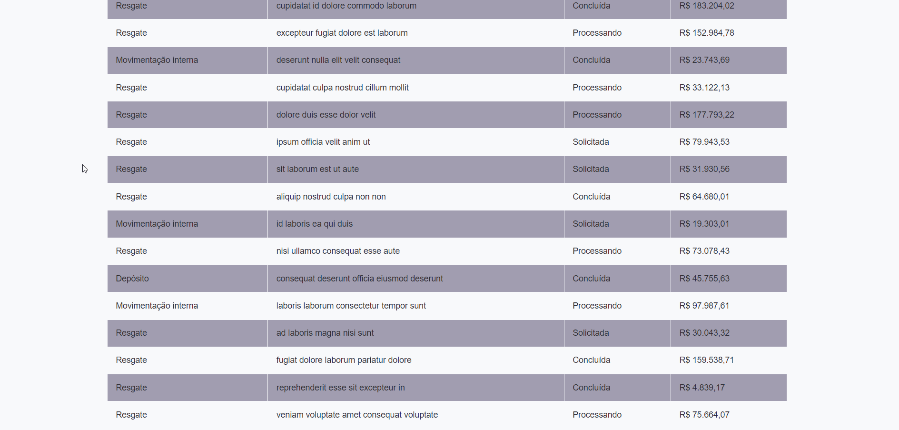

<h1 align="center">
  
</h1>

## 🚀 Tecnologias

---

Esse projeto foi desenvolvido com as seguintes tecnologias:

- ReactJS
- Typescript
- Styled Components

## 💻 Projeto

---

Esse projeto é a resolução de um desafio para uma vaga de front-end na Warren.

## 🔖 Informações do desafio original

---

Você pode visualizar todas as informações sobre o desafio [desse link](https://github.com/warrenbrasil/desafio-warren-web)

Feito ao vivo na <a href="https://twitch.tv/devlucaslopes" target="_blank">Twitch</a>.

